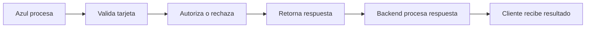

# Documentación de Integración - Azul Dominicana Payment Gateway

## 📋 Índice
1. [Información General](#información-general)
2. [Requisitos Previos](#requisitos-previos)
3. [Configuración Inicial](#configuración-inicial)
4. [Arquitectura de la Integración](#arquitectura-de-la-integración)
5. [Implementación Backend](#implementación-backend)
6. [Implementación Frontend](#implementación-frontend)
7. [Flujo de Transacción](#flujo-de-transacción)
8. [Manejo de Errores](#manejo-de-errores)
9. [Pruebas](#pruebas)
10. [Checklist de Implementación](#checklist-de-implementación)

## 🎯 Información General

### ¿Qué es Azul Dominicana?
Azul es el principal procesador de pagos de República Dominicana, manejando transacciones con tarjetas de crédito y débito tanto locales como internacionales.

### Características Principales
- **API REST con JSON**: Comunicación mediante endpoints HTTPS
- **Autenticación doble**: Headers Auth1 (usuario) y Auth2 (contraseña)
- **Certificados SSL**: Requeridos archivos .pem y .key para conexión segura
- **Modo prueba**: Ambiente sandbox para desarrollo
- **Soporte 3D Secure**: Para pagos seguros con autenticación adicional

### URLs de la API
```
Producción: https://pagos.azul.com.do/PaymentPage/
Sandbox: https://pruebas.azul.com.do/PaymentPage/
```

## 🔧 Requisitos Previos

### 1. Credenciales de Azul
Solicitar a Azul Dominicana:
- **Store ID**: Identificador único del comercio (ej: 39038540035)
- **Auth1**: Usuario de autenticación
- **Auth2**: Contraseña de autenticación
- **Certificados SSL**: Archivos .pem y .key

### 2. Infraestructura Técnica
- **Backend**: ASP.NET Core 8.0
- **Frontend**: Next.js 14
- **Base de datos**: PostgreSQL con Entity Framework Core
- **HTTPS**: Obligatorio para producción

### 3. Modelo de Datos
El modelo `PaymentProvider` ya existe con todos los campos necesarios:
```csharp
public class PaymentProvider
{
    public int Id { get; set; }
    public int CompanyId { get; set; }
    public string Name { get; set; }
    public string Provider { get; set; } // "azul"
    public bool IsActive { get; set; }
    public decimal TransactionFee { get; set; }
    public bool IsTestMode { get; set; }
    
    // Específicos para Azul
    public string? StoreId { get; set; }
    public string? Auth1 { get; set; } // Encriptado
    public string? Auth2 { get; set; } // Encriptado
    public string? CertificatePath { get; set; }
    public string? PrivateKeyPath { get; set; }
}
```

## 🏗️ Arquitectura de la Integración

### Flujo General
```
Cliente → Frontend → Backend API → Azul API → Respuesta → Backend → Frontend → Cliente
```

### Componentes Principales

#### Backend (WebsiteBuilderAPI)
1. **AzulPaymentService**: Servicio principal de integración
2. **PaymentController**: Endpoints para procesar pagos
3. **EncryptionService**: Para proteger credenciales
4. **CertificateManager**: Manejo de certificados SSL

#### Frontend (websitebuilder-admin)
1. **PaymentForm**: Formulario de pago
2. **AzulPaymentHandler**: Lógica de integración
3. **PaymentStatusComponent**: Visualización de estado

## 💻 Implementación Backend

### 1. Crear Servicio de Encriptación
```csharp
// Services/EncryptionService.cs
using System.Security.Cryptography;
using System.Text;

namespace WebsiteBuilderAPI.Services
{
    public interface IEncryptionService
    {
        string Encrypt(string plainText);
        string Decrypt(string cipherText);
    }

    public class EncryptionService : IEncryptionService
    {
        private readonly string _key;

        public EncryptionService(IConfiguration configuration)
        {
            _key = configuration["Encryption:Key"] ?? throw new Exception("Encryption key not configured");
        }

        public string Encrypt(string plainText)
        {
            using var aes = Aes.Create();
            aes.Key = Encoding.UTF8.GetBytes(_key.PadRight(32).Substring(0, 32));
            aes.IV = new byte[16];

            var encryptor = aes.CreateEncryptor(aes.Key, aes.IV);
            using var msEncrypt = new MemoryStream();
            using var csEncrypt = new CryptoStream(msEncrypt, encryptor, CryptoStreamMode.Write);
            using var swEncrypt = new StreamWriter(csEncrypt);
            
            swEncrypt.Write(plainText);
            return Convert.ToBase64String(msEncrypt.ToArray());
        }

        public string Decrypt(string cipherText)
        {
            using var aes = Aes.Create();
            aes.Key = Encoding.UTF8.GetBytes(_key.PadRight(32).Substring(0, 32));
            aes.IV = new byte[16];

            var decryptor = aes.CreateDecryptor(aes.Key, aes.IV);
            using var msDecrypt = new MemoryStream(Convert.FromBase64String(cipherText));
            using var csDecrypt = new CryptoStream(msDecrypt, decryptor, CryptoStreamMode.Read);
            using var srDecrypt = new StreamReader(csDecrypt);
            
            return srDecrypt.ReadToEnd();
        }
    }
}
```

### 2. Crear DTOs para Azul
```csharp
// DTOs/Azul/AzulPaymentRequestDto.cs
namespace WebsiteBuilderAPI.DTOs.Azul
{
    public class AzulPaymentRequestDto
    {
        public string Channel { get; set; } = "EC"; // E-commerce
        public string Store { get; set; } = string.Empty;
        public string CardNumber { get; set; } = string.Empty;
        public string Expiration { get; set; } = string.Empty; // YYYYMM
        public string CVC { get; set; } = string.Empty;
        public string PosInputMode { get; set; } = "E-Commerce";
        public string TrxType { get; set; } = "Sale";
        public string Amount { get; set; } = string.Empty; // Sin decimales
        public string Itbis { get; set; } = string.Empty; // Sin decimales
        public string CurrencyPosCode { get; set; } = "$";
        public string Payments { get; set; } = "1";
        public string Plan { get; set; } = "0";
        public string AcquirerRefData { get; set; } = "1";
        public string RRN { get; set; } = string.Empty; // Referencia única
        public string CustomerServicePhone { get; set; } = string.Empty;
        public string OrderNumber { get; set; } = string.Empty;
        public string ECommerceUrl { get; set; } = string.Empty;
        public string CustomOrderId { get; set; } = string.Empty;
        public string DataVaultToken { get; set; } = string.Empty;
        public string SaveToDataVault { get; set; } = "0";
    }

    public class AzulPaymentResponseDto
    {
        public string ResponseCode { get; set; } = string.Empty;
        public string ResponseMessage { get; set; } = string.Empty;
        public string ReasonCode { get; set; } = string.Empty;
        public string ReasonMessage { get; set; } = string.Empty;
        public string IsoCode { get; set; } = string.Empty;
        public string AuthorizationCode { get; set; } = string.Empty;
        public string RRN { get; set; } = string.Empty;
        public string CardNumber { get; set; } = string.Empty;
        public string DataVaultToken { get; set; } = string.Empty;
        public DateTime DateTime { get; set; }
        public string Ticket { get; set; } = string.Empty;
    }
}
```

### 3. Implementar Servicio de Azul
```csharp
// Services/AzulPaymentService.cs
using System.Net.Http;
using System.Security.Cryptography.X509Certificates;
using System.Text;
using System.Text.Json;
using WebsiteBuilderAPI.DTOs.Azul;

namespace WebsiteBuilderAPI.Services
{
    public interface IAzulPaymentService
    {
        Task<AzulPaymentResponseDto> ProcessPaymentAsync(AzulPaymentRequestDto request, int companyId);
        Task<bool> ValidateCredentialsAsync(int companyId);
    }

    public class AzulPaymentService : IAzulPaymentService
    {
        private readonly HttpClient _httpClient;
        private readonly IPaymentProviderRepository _providerRepo;
        private readonly IEncryptionService _encryptionService;
        private readonly ILogger<AzulPaymentService> _logger;

        public AzulPaymentService(
            HttpClient httpClient,
            IPaymentProviderRepository providerRepo,
            IEncryptionService encryptionService,
            ILogger<AzulPaymentService> logger)
        {
            _httpClient = httpClient;
            _providerRepo = providerRepo;
            _encryptionService = encryptionService;
            _logger = logger;
        }

        public async Task<AzulPaymentResponseDto> ProcessPaymentAsync(AzulPaymentRequestDto request, int companyId)
        {
            try
            {
                // 1. Obtener configuración de Azul
                var provider = await _providerRepo.GetActiveProviderAsync(companyId, "azul");
                if (provider == null)
                    throw new Exception("Azul payment provider not configured");

                // 2. Configurar certificados SSL
                ConfigureSSLCertificates(provider);

                // 3. Preparar request
                request.Store = provider.StoreId!;
                
                // 4. Configurar headers de autenticación
                _httpClient.DefaultRequestHeaders.Clear();
                _httpClient.DefaultRequestHeaders.Add("Auth1", _encryptionService.Decrypt(provider.Auth1!));
                _httpClient.DefaultRequestHeaders.Add("Auth2", _encryptionService.Decrypt(provider.Auth2!));
                _httpClient.DefaultRequestHeaders.Add("Content-Type", "application/json");

                // 5. Determinar URL según modo
                var baseUrl = provider.IsTestMode 
                    ? "https://pruebas.azul.com.do/PaymentPage/"
                    : "https://pagos.azul.com.do/PaymentPage/";

                // 6. Serializar y enviar request
                var json = JsonSerializer.Serialize(request);
                var content = new StringContent(json, Encoding.UTF8, "application/json");

                _logger.LogInformation($"Sending payment request to Azul for Company {companyId}");
                
                var response = await _httpClient.PostAsync($"{baseUrl}api/payment", content);
                var responseContent = await response.Content.ReadAsStringAsync();

                if (!response.IsSuccessStatusCode)
                {
                    _logger.LogError($"Azul API error: {response.StatusCode} - {responseContent}");
                    throw new Exception($"Payment processing failed: {response.StatusCode}");
                }

                // 7. Deserializar respuesta
                var result = JsonSerializer.Deserialize<AzulPaymentResponseDto>(responseContent);
                
                _logger.LogInformation($"Payment processed successfully. Response Code: {result?.ResponseCode}");
                
                return result ?? throw new Exception("Invalid response from Azul");
            }
            catch (Exception ex)
            {
                _logger.LogError(ex, "Error processing Azul payment");
                throw;
            }
        }

        public async Task<bool> ValidateCredentialsAsync(int companyId)
        {
            try
            {
                var provider = await _providerRepo.GetActiveProviderAsync(companyId, "azul");
                if (provider == null) return false;

                // Verificar que existan las credenciales necesarias
                return !string.IsNullOrEmpty(provider.StoreId) &&
                       !string.IsNullOrEmpty(provider.Auth1) &&
                       !string.IsNullOrEmpty(provider.Auth2) &&
                       !string.IsNullOrEmpty(provider.CertificatePath) &&
                       !string.IsNullOrEmpty(provider.PrivateKeyPath) &&
                       File.Exists(provider.CertificatePath) &&
                       File.Exists(provider.PrivateKeyPath);
            }
            catch
            {
                return false;
            }
        }

        private void ConfigureSSLCertificates(PaymentProvider provider)
        {
            if (string.IsNullOrEmpty(provider.CertificatePath) || string.IsNullOrEmpty(provider.PrivateKeyPath))
                throw new Exception("SSL certificates not configured");

            // Cargar certificado .pem y llave privada .key
            var certificate = X509Certificate2.CreateFromPemFile(
                provider.CertificatePath,
                provider.PrivateKeyPath
            );

            // Configurar handler con certificado
            var handler = new HttpClientHandler();
            handler.ClientCertificates.Add(certificate);
            
            // Nota: En producción real, deberías usar HttpClientFactory
            // y configurar el handler apropiadamente
        }
    }
}
```

### 4. Crear Controller de Pagos
```csharp
// Controllers/PaymentController.cs
using Microsoft.AspNetCore.Authorization;
using Microsoft.AspNetCore.Mvc;
using WebsiteBuilderAPI.DTOs.Azul;
using WebsiteBuilderAPI.Services;

namespace WebsiteBuilderAPI.Controllers
{
    [Authorize]
    [ApiController]
    [Route("api/[controller]")]
    public class PaymentController : ControllerBase
    {
        private readonly IAzulPaymentService _azulService;
        private readonly IPaymentProviderService _providerService;
        private readonly ILogger<PaymentController> _logger;

        public PaymentController(
            IAzulPaymentService azulService,
            IPaymentProviderService providerService,
            ILogger<PaymentController> logger)
        {
            _azulService = azulService;
            _providerService = providerService;
            _logger = logger;
        }

        [HttpPost("process")]
        public async Task<ActionResult<PaymentResponseDto>> ProcessPayment([FromBody] ProcessPaymentDto request)
        {
            try
            {
                var companyId = GetCompanyId(); // Obtener del contexto de usuario

                // Determinar proveedor activo
                var activeProvider = await _providerService.GetActiveProviderAsync(companyId);
                if (activeProvider == null)
                    return BadRequest(new { error = "No active payment provider configured" });

                // Procesar según proveedor
                switch (activeProvider.Provider.ToLower())
                {
                    case "azul":
                        var azulRequest = MapToAzulRequest(request);
                        var azulResponse = await _azulService.ProcessPaymentAsync(azulRequest, companyId);
                        return Ok(MapFromAzulResponse(azulResponse));
                    
                    case "stripe":
                        // TODO: Implementar Stripe
                        break;
                    
                    case "paypal":
                        // TODO: Implementar PayPal
                        break;
                    
                    default:
                        return BadRequest(new { error = "Unsupported payment provider" });
                }

                return BadRequest();
            }
            catch (Exception ex)
            {
                _logger.LogError(ex, "Error processing payment");
                return StatusCode(500, new { error = "Payment processing failed" });
            }
        }

        [HttpGet("providers/{companyId}")]
        public async Task<ActionResult<List<PaymentProviderDto>>> GetProviders(int companyId)
        {
            try
            {
                var providers = await _providerService.GetProvidersAsync(companyId);
                return Ok(providers);
            }
            catch (Exception ex)
            {
                _logger.LogError(ex, "Error getting payment providers");
                return StatusCode(500, new { error = "Failed to retrieve providers" });
            }
        }

        [HttpPost("providers")]
        public async Task<ActionResult<PaymentProviderDto>> ConfigureProvider([FromBody] ConfigureProviderDto request)
        {
            try
            {
                var companyId = GetCompanyId();
                var result = await _providerService.ConfigureProviderAsync(companyId, request);
                return Ok(result);
            }
            catch (Exception ex)
            {
                _logger.LogError(ex, "Error configuring payment provider");
                return StatusCode(500, new { error = "Failed to configure provider" });
            }
        }

        [HttpPut("providers/{providerId}/activate")]
        public async Task<ActionResult> ActivateProvider(int providerId)
        {
            try
            {
                var companyId = GetCompanyId();
                await _providerService.ActivateProviderAsync(companyId, providerId);
                return Ok(new { message = "Provider activated successfully" });
            }
            catch (Exception ex)
            {
                _logger.LogError(ex, "Error activating payment provider");
                return StatusCode(500, new { error = "Failed to activate provider" });
            }
        }

        private AzulPaymentRequestDto MapToAzulRequest(ProcessPaymentDto request)
        {
            // Formatear fecha de expiración MM/YY a YYYYMM
            var expParts = request.CardExpiry.Split('/');
            var expMonth = expParts[0].PadLeft(2, '0');
            var expYear = $"20{expParts[1]}"; // Asumiendo 20XX
            
            return new AzulPaymentRequestDto
            {
                CardNumber = request.CardNumber.Replace(" ", ""),
                Expiration = $"{expYear}{expMonth}",
                CVC = request.CardCVC,
                Amount = ((int)(request.Amount * 100)).ToString(), // Convertir a centavos sin decimales
                Itbis = ((int)(request.Amount * 0.18 * 100)).ToString(), // 18% ITBIS
                OrderNumber = request.OrderId,
                RRN = GenerateRRN(),
                CustomerServicePhone = request.CustomerPhone ?? "",
                ECommerceUrl = request.ReturnUrl ?? "",
                CustomOrderId = request.OrderId
            };
        }

        private PaymentResponseDto MapFromAzulResponse(AzulPaymentResponseDto response)
        {
            return new PaymentResponseDto
            {
                Success = response.ResponseCode == "00",
                TransactionId = response.RRN,
                AuthorizationCode = response.AuthorizationCode,
                Message = response.ResponseMessage,
                ErrorCode = response.ResponseCode != "00" ? response.ResponseCode : null,
                CardLastFour = response.CardNumber?.Substring(response.CardNumber.Length - 4),
                ProcessedAt = response.DateTime
            };
        }

        private string GenerateRRN()
        {
            // Generar referencia única de 12 dígitos
            return DateTime.Now.ToString("yyMMddHHmmss");
        }

        private int GetCompanyId()
        {
            // TODO: Obtener del contexto de autenticación/tenant
            return 1;
        }
    }
}
```

### 5. Configurar Servicios en Program.cs
```csharp
// Program.cs - Agregar en ConfigureServices
builder.Services.AddScoped<IEncryptionService, EncryptionService>();
builder.Services.AddScoped<IAzulPaymentService, AzulPaymentService>();
builder.Services.AddScoped<IPaymentProviderService, PaymentProviderService>();
builder.Services.AddScoped<IPaymentProviderRepository, PaymentProviderRepository>();

// Configurar HttpClient para Azul
builder.Services.AddHttpClient<IAzulPaymentService, AzulPaymentService>(client =>
{
    client.Timeout = TimeSpan.FromSeconds(30);
});
```

### 6. Agregar Configuración en appsettings.json
```json
{
  "Encryption": {
    "Key": "YOUR-32-CHARACTER-ENCRYPTION-KEY-HERE"
  },
  "PaymentProviders": {
    "Azul": {
      "TestMode": true,
      "CertificatesPath": "Certificates/Azul/",
      "TransactionFee": 2.95
    }
  }
}
```

## 🎨 Implementación Frontend

### 1. Crear Modal de Configuración de Azul
```typescript
// src/app/empresa/payments/components/AzulConfigModal.tsx
import { useState } from 'react';
import * as Dialog from '@radix-ui/react-dialog';
import { X, Upload, Info } from 'lucide-react';
import { useI18n } from '@/lib/i18n/client';

interface AzulConfigModalProps {
  isOpen: boolean;
  onClose: () => void;
  onSave: (config: AzulConfig) => void;
  initialConfig?: AzulConfig;
}

interface AzulConfig {
  storeId: string;
  auth1: string;
  auth2: string;
  certificateFile?: File;
  privateKeyFile?: File;
  isTestMode: boolean;
  transactionFee: number;
}

export function AzulConfigModal({ isOpen, onClose, onSave, initialConfig }: AzulConfigModalProps) {
  const { t } = useI18n();
  const [config, setConfig] = useState<AzulConfig>({
    storeId: initialConfig?.storeId || '',
    auth1: initialConfig?.auth1 || '',
    auth2: initialConfig?.auth2 || '',
    isTestMode: initialConfig?.isTestMode ?? true,
    transactionFee: initialConfig?.transactionFee || 2.95
  });

  const handleSubmit = (e: React.FormEvent) => {
    e.preventDefault();
    
    // Validaciones
    if (!config.storeId || !config.auth1 || !config.auth2) {
      alert(t('payments.azul.validation.required'));
      return;
    }

    if (!initialConfig && (!config.certificateFile || !config.privateKeyFile)) {
      alert(t('payments.azul.validation.certificates'));
      return;
    }

    onSave(config);
  };

  const handleFileChange = (field: 'certificateFile' | 'privateKeyFile') => (e: React.ChangeEvent<HTMLInputElement>) => {
    const file = e.target.files?.[0];
    if (file) {
      setConfig(prev => ({ ...prev, [field]: file }));
    }
  };

  return (
    <Dialog.Root open={isOpen} onOpenChange={onClose}>
      <Dialog.Portal>
        <Dialog.Overlay className="fixed inset-0 bg-black/50 animate-fade-in" />
        <Dialog.Content className="fixed top-1/2 left-1/2 -translate-x-1/2 -translate-y-1/2 bg-white dark:bg-gray-800 rounded-lg shadow-xl w-full max-w-2xl max-h-[90vh] overflow-y-auto animate-scale-in">
          <div className="sticky top-0 bg-white dark:bg-gray-800 border-b border-gray-200 dark:border-gray-700 p-6">
            <div className="flex items-center justify-between">
              <div className="flex items-center gap-3">
                
                <Dialog.Title className="text-xl font-semibold text-gray-900 dark:text-white">
                  {t('payments.azul.configure')}
                </Dialog.Title>
              </div>
              <Dialog.Close asChild>
                <button className="text-gray-400 hover:text-gray-600 dark:hover:text-gray-300">
                  <X className="w-5 h-5" />
                </button>
              </Dialog.Close>
            </div>
          </div>

          <form onSubmit={handleSubmit} className="p-6 space-y-6">
            {/* Información importante */}
            <div className="bg-blue-50 dark:bg-blue-900/20 rounded-lg p-4">
              <div className="flex gap-3">
                <Info className="w-5 h-5 text-blue-600 dark:text-blue-400 flex-shrink-0 mt-0.5" />
                <div className="space-y-2 text-sm text-blue-800 dark:text-blue-200">
                  <p>{t('payments.azul.info.credentials')}</p>
                  <p>{t('payments.azul.info.certificates')}</p>
                  <p>{t('payments.azul.info.production')}</p>
                  <p className="font-semibold">{t('payments.azul.info.contact')}: 809-544-2985</p>
                </div>
              </div>
            </div>

            {/* Credenciales de API */}
            <div className="space-y-4">
              <h3 className="font-medium text-gray-900 dark:text-white">
                {t('payments.azul.credentials.title')}
              </h3>
              
              <div>
                <label className="block text-sm font-medium text-gray-700 dark:text-gray-300 mb-1">
                  Store ID *
                </label>
                <input
                  type="text"
                  value={config.storeId}
                  onChange={(e) => setConfig(prev => ({ ...prev, storeId: e.target.value }))}
                  placeholder="39038540035"
                  className="w-full px-3 py-2 border border-gray-300 dark:border-gray-600 rounded-lg bg-white dark:bg-gray-700 text-gray-900 dark:text-white"
                  required
                />
              </div>

              <div>
                <label className="block text-sm font-medium text-gray-700 dark:text-gray-300 mb-1">
                  {t('payments.azul.credentials.username')} (Auth1) *
                </label>
                <input
                  type="text"
                  value={config.auth1}
                  onChange={(e) => setConfig(prev => ({ ...prev, auth1: e.target.value }))}
                  className="w-full px-3 py-2 border border-gray-300 dark:border-gray-600 rounded-lg bg-white dark:bg-gray-700 text-gray-900 dark:text-white"
                  required
                />
              </div>

              <div>
                <label className="block text-sm font-medium text-gray-700 dark:text-gray-300 mb-1">
                  {t('payments.azul.credentials.password')} (Auth2) *
                </label>
                <input
                  type="password"
                  value={config.auth2}
                  onChange={(e) => setConfig(prev => ({ ...prev, auth2: e.target.value }))}
                  className="w-full px-3 py-2 border border-gray-300 dark:border-gray-600 rounded-lg bg-white dark:bg-gray-700 text-gray-900 dark:text-white"
                  required
                />
              </div>
            </div>

            {/* Certificados SSL */}
            <div className="space-y-4">
              <h3 className="font-medium text-gray-900 dark:text-white">
                {t('payments.azul.certificates.title')}
              </h3>
              
              <div>
                <label className="block text-sm font-medium text-gray-700 dark:text-gray-300 mb-1">
                  {t('payments.azul.certificates.pem')} (.pem) *
                </label>
                <div className="flex items-center gap-3">
                  <input
                    type="file"
                    accept=".pem"
                    onChange={handleFileChange('certificateFile')}
                    className="hidden"
                    id="certificate-file"
                  />
                  <label
                    htmlFor="certificate-file"
                    className="flex items-center gap-2 px-4 py-2 border border-gray-300 dark:border-gray-600 rounded-lg bg-white dark:bg-gray-700 text-gray-700 dark:text-gray-300 hover:bg-gray-50 dark:hover:bg-gray-600 cursor-pointer"
                  >
                    <Upload className="w-4 h-4" />
                    {config.certificateFile?.name || t('payments.azul.certificates.select')}
                  </label>
                </div>
              </div>

              <div>
                <label className="block text-sm font-medium text-gray-700 dark:text-gray-300 mb-1">
                  {t('payments.azul.certificates.key')} (.key) *
                </label>
                <div className="flex items-center gap-3">
                  <input
                    type="file"
                    accept=".key"
                    onChange={handleFileChange('privateKeyFile')}
                    className="hidden"
                    id="private-key-file"
                  />
                  <label
                    htmlFor="private-key-file"
                    className="flex items-center gap-2 px-4 py-2 border border-gray-300 dark:border-gray-600 rounded-lg bg-white dark:bg-gray-700 text-gray-700 dark:text-gray-300 hover:bg-gray-50 dark:hover:bg-gray-600 cursor-pointer"
                  >
                    <Upload className="w-4 h-4" />
                    {config.privateKeyFile?.name || t('payments.azul.certificates.select')}
                  </label>
                </div>
              </div>
            </div>

            {/* Configuración del entorno */}
            <div className="space-y-4">
              <h3 className="font-medium text-gray-900 dark:text-white">
                {t('payments.azul.environment.title')}
              </h3>
              
              <div className="flex items-center gap-3">
                <input
                  type="checkbox"
                  id="test-mode"
                  checked={config.isTestMode}
                  onChange={(e) => setConfig(prev => ({ ...prev, isTestMode: e.target.checked }))}
                  className="w-4 h-4 text-blue-600 rounded"
                />
                <label htmlFor="test-mode" className="text-sm text-gray-700 dark:text-gray-300">
                  {t('payments.azul.environment.testMode')}
                </label>
              </div>

              <div>
                <label className="block text-sm font-medium text-gray-700 dark:text-gray-300 mb-1">
                  {t('payments.azul.environment.fee')} (%)
                </label>
                <input
                  type="number"
                  step="0.01"
                  min="0"
                  max="10"
                  value={config.transactionFee}
                  onChange={(e) => setConfig(prev => ({ ...prev, transactionFee: parseFloat(e.target.value) }))}
                  className="w-full px-3 py-2 border border-gray-300 dark:border-gray-600 rounded-lg bg-white dark:bg-gray-700 text-gray-900 dark:text-white"
                />
              </div>
            </div>

            {/* Acciones */}
            <div className="flex justify-end gap-3 pt-4 border-t border-gray-200 dark:border-gray-700">
              <button
                type="button"
                onClick={onClose}
                className="px-4 py-2 text-gray-700 dark:text-gray-300 hover:bg-gray-100 dark:hover:bg-gray-700 rounded-lg"
              >
                {t('common.cancel')}
              </button>
              <button
                type="submit"
                className="px-4 py-2 bg-blue-600 text-white rounded-lg hover:bg-blue-700"
              >
                {t('common.save')}
              </button>
            </div>
          </form>
        </Dialog.Content>
      </Dialog.Portal>
    </Dialog.Root>
  );
}
```

### 2. Crear Servicio de API para Pagos
```typescript
// src/lib/api/payment.service.ts
import { apiClient } from '@/lib/api/client';

export interface PaymentProvider {
  id: number;
  name: string;
  provider: string;
  isActive: boolean;
  isTestMode: boolean;
  transactionFee: number;
  logo?: string;
}

export interface ConfigureProviderDto {
  provider: string;
  storeId?: string;
  auth1?: string;
  auth2?: string;
  certificateFile?: File;
  privateKeyFile?: File;
  isTestMode: boolean;
  transactionFee: number;
}

export interface ProcessPaymentDto {
  amount: number;
  cardNumber: string;
  cardExpiry: string;
  cardCVC: string;
  cardHolderName: string;
  orderId: string;
  customerEmail?: string;
  customerPhone?: string;
  returnUrl?: string;
}

export interface PaymentResponse {
  success: boolean;
  transactionId?: string;
  authorizationCode?: string;
  message: string;
  errorCode?: string;
  cardLastFour?: string;
  processedAt: Date;
}

export const paymentService = {
  // Obtener proveedores de pago
  async getProviders(companyId: number): Promise<PaymentProvider[]> {
    const response = await apiClient.get(`/payment/providers/${companyId}`);
    return response.data;
  },

  // Configurar proveedor
  async configureProvider(config: ConfigureProviderDto): Promise<PaymentProvider> {
    const formData = new FormData();
    
    // Agregar campos básicos
    Object.entries(config).forEach(([key, value]) => {
      if (value !== undefined && value !== null && !(value instanceof File)) {
        formData.append(key, value.toString());
      }
    });

    // Agregar archivos si existen
    if (config.certificateFile) {
      formData.append('certificateFile', config.certificateFile);
    }
    if (config.privateKeyFile) {
      formData.append('privateKeyFile', config.privateKeyFile);
    }

    const response = await apiClient.post('/payment/providers', formData, {
      headers: {
        'Content-Type': 'multipart/form-data'
      }
    });
    
    return response.data;
  },

  // Activar proveedor
  async activateProvider(providerId: number): Promise<void> {
    await apiClient.put(`/payment/providers/${providerId}/activate`);
  },

  // Procesar pago
  async processPayment(payment: ProcessPaymentDto): Promise<PaymentResponse> {
    const response = await apiClient.post('/payment/process', payment);
    return response.data;
  }
};
```

### 3. Actualizar PaymentsTab para usar Modal
```typescript
// src/app/empresa/payments/PaymentsTab.tsx - Agregar
import { AzulConfigModal } from './components/AzulConfigModal';
import { paymentService } from '@/lib/api/payment.service';

// Dentro del componente PaymentsTab
const [selectedProvider, setSelectedProvider] = useState<string | null>(null);
const [loading, setLoading] = useState(false);

const handleConfigureProvider = (providerId: string) => {
  setSelectedProvider(providerId);
};

const handleSaveAzulConfig = async (config: AzulConfig) => {
  try {
    setLoading(true);
    
    await paymentService.configureProvider({
      provider: 'azul',
      storeId: config.storeId,
      auth1: config.auth1,
      auth2: config.auth2,
      certificateFile: config.certificateFile,
      privateKeyFile: config.privateKeyFile,
      isTestMode: config.isTestMode,
      transactionFee: config.transactionFee
    });

    // Actualizar estado local
    setProviders(prev => prev.map(p => 
      p.id === 'azul' 
        ? { ...p, status: 'configured' as const }
        : p
    ));

    setSelectedProvider(null);
    toast.success(t('payments.azul.success'));
  } catch (error) {
    console.error('Error configuring Azul:', error);
    toast.error(t('payments.azul.error'));
  } finally {
    setLoading(false);
  }
};

// En el JSX, agregar el modal
{selectedProvider === 'azul' && (
  <AzulConfigModal
    isOpen={true}
    onClose={() => setSelectedProvider(null)}
    onSave={handleSaveAzulConfig}
  />
)}
```

## 🔄 Flujo de Transacción

### 1. Cliente inicia pago

```mermaid
graph LR
    A[Cliente] --> B[Formulario de Pago]
    B --> C[Frontend valida datos]
    C --> D[Envía a Backend API]
```


### 2. Backend procesa

```mermaid
graph LR
    A[Backend recibe request] --> B[Valida datos]
    B --> C[Obtiene config Azul]
    C --> D[Encripta y formatea]
    D --> E[Envía a Azul API]
```


### 3. Azul responde


## ⚠️ Manejo de Errores

### Códigos de Respuesta Comunes de Azul
```typescript
const AZUL_RESPONSE_CODES = {
  '00': 'Aprobada',
  '01': 'Referir al emisor',
  '04': 'Retener tarjeta',
  '05': 'Transacción rechazada',
  '12': 'Transacción inválida',
  '13': 'Monto inválido',
  '14': 'Tarjeta inválida',
  '30': 'Error de formato',
  '41': 'Tarjeta perdida',
  '43': 'Tarjeta robada',
  '51': 'Fondos insuficientes',
  '54': 'Tarjeta expirada',
  '55': 'PIN incorrecto',
  '61': 'Excede límite de retiro',
  '65': 'Excede límite de transacciones',
  '91': 'Emisor no disponible',
  '96': 'Error del sistema'
};
```

### Implementar Manejo de Errores
```typescript
// src/lib/utils/payment-errors.ts
export class PaymentError extends Error {
  constructor(
    public code: string,
    public userMessage: string,
    public technicalMessage?: string
  ) {
    super(userMessage);
    this.name = 'PaymentError';
  }
}

export function handleAzulError(responseCode: string): PaymentError {
  const messages: Record<string, string> = {
    '01': 'Por favor contacte a su banco',
    '05': 'Transacción rechazada por el banco',
    '14': 'Número de tarjeta inválido',
    '51': 'Fondos insuficientes',
    '54': 'Tarjeta expirada',
    // ... más códigos
  };

  const userMessage = messages[responseCode] || 'Error procesando el pago';
  return new PaymentError(responseCode, userMessage);
}
```

## 🧪 Pruebas

### 1. Tarjetas de Prueba para Sandbox
```
VISA Aprobada: 4035874000424977
MasterCard Aprobada: 5100060000000002
VISA Rechazada: 4035874000424985
MasterCard Rechazada: 5100060000000010

CVV: Cualquier 3 dígitos
Fecha: Cualquier fecha futura (MM/YY)
```

### 2. Test de Integración
```csharp
// Tests/Services/AzulPaymentServiceTests.cs
using Xunit;
using Moq;
using WebsiteBuilderAPI.Services;

public class AzulPaymentServiceTests
{
    private readonly Mock<IPaymentProviderRepository> _mockRepo;
    private readonly Mock<IEncryptionService> _mockEncryption;
    private readonly AzulPaymentService _service;

    public AzulPaymentServiceTests()
    {
        _mockRepo = new Mock<IPaymentProviderRepository>();
        _mockEncryption = new Mock<IEncryptionService>();
        var mockLogger = new Mock<ILogger<AzulPaymentService>>();
        var httpClient = new HttpClient();
        
        _service = new AzulPaymentService(httpClient, _mockRepo.Object, _mockEncryption.Object, mockLogger.Object);
    }

    [Fact]
    public async Task ProcessPayment_ValidRequest_ReturnsSuccess()
    {
        // Arrange
        var provider = new PaymentProvider
        {
            StoreId = "39038540035",
            Auth1 = "encrypted_user",
            Auth2 = "encrypted_pass",
            IsTestMode = true
        };

        _mockRepo.Setup(x => x.GetActiveProviderAsync(It.IsAny<int>(), "azul"))
            .ReturnsAsync(provider);
        
        _mockEncryption.Setup(x => x.Decrypt(It.IsAny<string>()))
            .Returns("decrypted_value");

        var request = new AzulPaymentRequestDto
        {
            CardNumber = "4035874000424977",
            Expiration = "202512",
            CVC = "123",
            Amount = "10000" // $100.00
        };

        // Act
        var result = await _service.ProcessPaymentAsync(request, 1);

        // Assert
        Assert.NotNull(result);
        Assert.Equal("00", result.ResponseCode);
        Assert.NotEmpty(result.AuthorizationCode);
    }
}
```

### 3. Test Frontend (Cypress)
```typescript
// cypress/e2e/payment-azul.cy.ts
describe('Azul Payment Integration', () => {
  beforeEach(() => {
    cy.login();
    cy.visit('/empresa/payments');
  });

  it('should configure Azul provider', () => {
    // Click configure on Azul card
    cy.get('[data-provider="azul"]').find('button:contains("Configurar")').click();
    
    // Fill configuration form
    cy.get('input[placeholder="39038540035"]').type('39038540035');
    cy.get('input[type="text"]:eq(1)').type('testuser');
    cy.get('input[type="password"]').type('testpass');
    
    // Upload files
    cy.get('input[type="file"]#certificate-file').selectFile('cypress/fixtures/test-cert.pem');
    cy.get('input[type="file"]#private-key-file').selectFile('cypress/fixtures/test-key.key');
    
    // Save
    cy.get('button:contains("Guardar")').click();
    
    // Verify success
    cy.get('.toast-success').should('contain', 'Configuración guardada');
  });

  it('should process test payment', () => {
    // Navigate to checkout
    cy.visit('/checkout');
    
    // Fill payment form
    cy.get('input[name="cardNumber"]').type('4035874000424977');
    cy.get('input[name="cardExpiry"]').type('12/25');
    cy.get('input[name="cardCVC"]').type('123');
    cy.get('input[name="cardName"]').type('Test User');
    
    // Submit
    cy.get('button[type="submit"]').click();
    
    // Verify success
    cy.get('.payment-success').should('be.visible');
    cy.get('.transaction-id').should('not.be.empty');
  });
});
```

## ✅ Checklist de Implementación

### Backend
- [ ] Crear servicio de encriptación para credenciales
- [ ] Implementar DTOs para request/response de Azul
- [ ] Crear AzulPaymentService con manejo de certificados SSL
- [ ] Implementar PaymentController con endpoints necesarios
- [ ] Configurar inyección de dependencias en Program.cs
- [ ] Agregar configuración en appsettings.json
- [ ] Crear middleware para validación de tenant/company
- [ ] Implementar logging detallado
- [ ] Crear tests unitarios para servicios
- [ ] Documentar API con Swagger

### Frontend
- [ ] Crear modal de configuración de Azul
- [ ] Implementar servicio de API para pagos
- [ ] Actualizar PaymentsTab con lógica de configuración
- [ ] Crear componente de formulario de pago
- [ ] Implementar validación de tarjetas
- [ ] Agregar manejo de errores con mensajes claros
- [ ] Crear componente de estado de transacción
- [ ] Implementar tests E2E con Cypress
- [ ] Agregar traducciones i18n
- [ ] Optimizar para móviles

### Seguridad
- [ ] Encriptar credenciales en base de datos
- [ ] Validar certificados SSL antes de usar
- [ ] Implementar rate limiting
- [ ] Agregar logs de auditoría
- [ ] Validar montos y formatos
- [ ] Implementar CSRF protection
- [ ] Configurar CORS apropiadamente
- [ ] Validar permisos por tenant

### Infraestructura
- [ ] Crear carpeta para certificados SSL
- [ ] Configurar backups de certificados
- [ ] Implementar monitoreo de transacciones
- [ ] Configurar alertas de errores
- [ ] Preparar scripts de deployment
- [ ] Documentar proceso de actualización de certificados

### Testing
- [ ] Probar con tarjetas de prueba
- [ ] Verificar manejo de todos los códigos de error
- [ ] Probar timeouts y reintentos
- [ ] Validar montos con decimales
- [ ] Probar en modo producción (con cuidado)
- [ ] Verificar logs y auditoría
- [ ] Probar con múltiples companies/tenants

## 📚 Referencias

- **Documentación Azul**: Contactar al 809-544-2985
- **Soporte técnico**: soporte@azul.com.do
- **Portal de comercios**: https://www.azul.com.do/comercios
- **Estado de servicios**: https://status.azul.com.do

## 🆘 Soporte

Si encuentras problemas durante la implementación:

1. Verifica los logs del servidor para errores detallados
2. Confirma que los certificados SSL estén correctamente instalados
3. Valida que las credenciales estén bien encriptadas
4. Revisa que el Store ID corresponda al ambiente (pruebas/producción)
5. Contacta a soporte técnico de Azul si el error persiste

---

**Última actualización**: Agosto 2025
**Versión**: 1.0.0
**Autor**: Claude - Website Builder Team